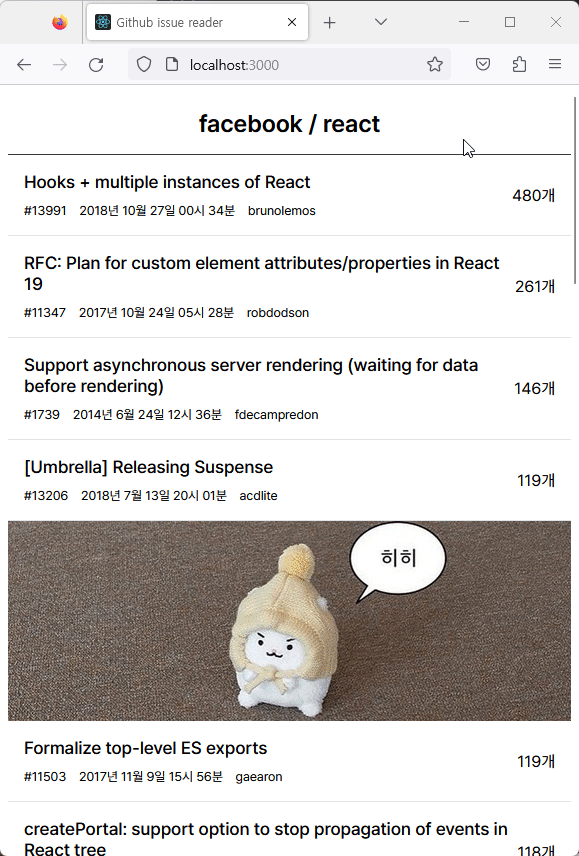
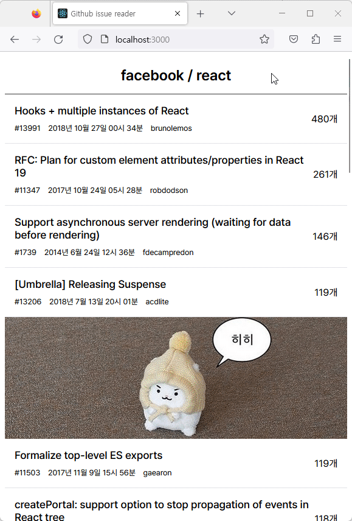

# 🔎 github issue reader

원티드 프리온보딩 인턴십 2주차 개인 과제 레포지토리입니다.

- 주제 : 특정 깃헙 레파지토리의 이슈 목록과 상세 내용을 확인하는 웹 사이트 구축
- 작업 기한 : 2023.08.29 ~2023.09.01

## 📝 과제 요구사항

- 이슈 목록 및 상세 화면 기능 구현
- 데이터 요청 중 로딩 표시
- 에러 화면 구현
- 지정된 조건(open 상태, 코멘트 많은 순)에 맞게 데이터 요청 및 표시

## 🛠 사용한 기술 스택 및 라이브러리

- `Creat-React-App`
- `React`
- `Typescript`
- `React-Router-Dom`
- `Styled-Components`
- `Octokit`

## 🚀 배포 링크

https://github-issue-reader.vercel.app/

## 🗂️ 폴더 구조

```base
.
├── README.md
├── package-lock.json
├── package.json
├── public
├── src
│   ├── App.tsx
│   ├── api
│   │   ├── octokitService.ts
│   │   └── type.ts
│   ├── components
│   │   ├── domain
│   │   │   ├── IssueDetail.tsx
│   │   │   ├── IssueItem.tsx
│   │   │   └── IssueList.tsx
│   │   ├── index.ts
│   │   └── ui
│   │       └── Header.tsx
│   ├── globalStyles.ts
│   ├── index.tsx
│   ├── logo.svg
│   ├── pages
│   │   ├── IssueDetailPage.tsx
│   │   ├── IssueListPage.tsx
│   │   ├── NotFound.tsx
│   │   └── index.ts
│   ├── router
│   │   ├── index.ts
│   │   └── router.tsx
│   └── utils
│       ├── formatDateString.ts
│       └── index.ts
├── tsconfig.json
```

## Preview

<div style="text-align:center">


</div>

| 이슈 목록                        | 이슈 상세                            |
| -------------------------------- | ------------------------------------ |
|  |  |

| 페이지 에러 핸들링                | 에러 페이지                       |
| --------------------------------- | --------------------------------- |
|  |  |

- intersectionObserver를 이용한 무한 스크롤 구현
- octokit을 이용한 깃헙 api 호출
- react-router-dom을 이용한 라우팅
- lazy, Suspense를 이용한 코드 스플리팅
- 사용자의 url 수정에 따른 에러 핸들링
