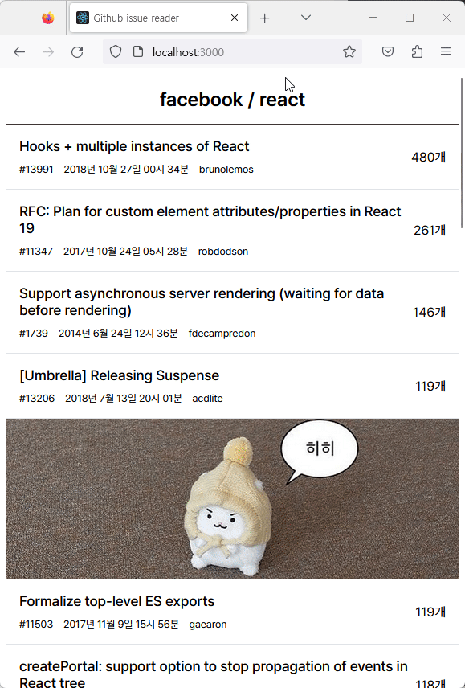
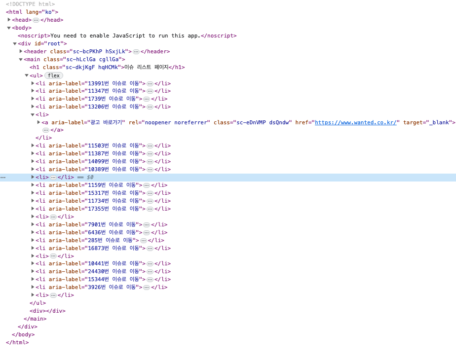

# 🔎 github issue reader

원티드 프리온보딩 인턴십 2주차 개인 과제 레포지토리입니다.

## 🎯 프로젝트 소개

- **주제** : 특정 깃헙 레파지토리의 이슈 목록과 상세 내용을 확인하는 웹 사이트 구축
- **작업 기간** : 2023.08.29 ~2023.09.01
- **팀 작업 레포지토리** : [pre-onboarding-12th-2-3](https://github.com/pre-onboarding-12th-team3/pre-onboarding-12th-2-3)

## 📝 과제 요구사항

- 이슈 목록 및 상세 화면 기능 구현
- 화면을 아래로 스크롤 할 시 이슈 목록 추가 로딩(라이브러리 사용 금지)
- 다섯번째 셀마다 광고 이미지 출력
- 데이터 요청 중 로딩 표시
- 에러 화면 구현
- 지정된 조건(open 상태, 코멘트 많은 순)에 맞게 데이터 요청 및 표시

## 🛠 사용한 기술 스택 및 라이브러리

- `Creat-React-App`
- `React`
- `Typescript`
- `React-Router-Dom`
- `Styled-Components`
- `Octokit`

## 🚀 배포 링크

https://github-issue-reader.vercel.app/

## 🗂️ 폴더 구조

```base
.
├── README.md
├── package-lock.json
├── package.json
├── public
├── src
│   ├── App.tsx
│   ├── api
│   │   ├── octokitService.ts
│   │   └── type.ts
│   ├── components
│   │   ├── domain
│   │   │   ├── IssueDetail.tsx
│   │   │   ├── IssueItem.tsx
│   │   │   └── IssueList.tsx
│   │   ├── index.ts
│   │   └── ui
│   │       └── Header.tsx
│   ├── globalStyles.ts
│   ├── index.tsx
│   ├── logo.svg
│   ├── pages
│   │   ├── IssueDetailPage.tsx
│   │   ├── IssueListPage.tsx
│   │   ├── NotFound.tsx
│   │   └── index.ts
│   ├── router
│   │   ├── index.ts
│   │   └── router.tsx
│   └── utils
│       ├── formatDateString.ts
│       └── index.ts
├── tsconfig.json
```

## ✏️ 구현 내용

<div style="text-align:center">


</div>

| 이슈 목록                        | 이슈 상세                            |
| -------------------------------- | ------------------------------------ |
|  |  |

| 페이지 에러 핸들링                | 에러 페이지                           |
| --------------------------------- | ------------------------------------- |
|  |  |

#### intersectionObserver를 이용한 무한 스크롤 구현

- 옵저빙을 위해 생성한 div는 조건부 렌더링으로 보이지 않게 설정해놓고 데이터 패칭이 진행 중일 때에는 로딩스피너 역할을 하도록 했습니다.

#### octokit을 이용한 깃헙 api 호출

- 이슈 목록을 불러오기

  ```tsx
  useEffect(() => {
    const fetchIssues = async () => {
      if (!hasNext) return;
      setIsFetching(true);
      try {
        const fetchedIssues = await getIssues(20, page);

        const newHasNext = fetchedIssues.length === 20;
        setData((prevData) => ({
          issues: [...prevData.issues, ...fetchedIssues],
          hasNext: newHasNext,
        }));
      } catch {
        alert("데이터를 불러오는데 실패했습니다.");
      } finally {
        setIsFetching(false);
      }
    };
    fetchIssues();
  }, [page, hasNext]);
  ```

  - 데이터 요청할 때 인자로 한 번 요청할 때 보여줄 데이터 개수와 페이지 번호를 넘겨줍니다.
  - 받아온 데이터가 불러온 데이터 개수보다 적을 때는 더 이상 데이터를 요청하지 않습니다.

- 이슈 상세 내용을 불러오기
  - `useParams` 로 넘어온 이슈 넘버를 이용해 데이터 요청합니다.
  - 이때 사용자가 url을 수정해 유효하지 않은 주소를 입력했을 때 에러 메세지가 출력 되도록 했습니다.

#### 사용자의 url 수정에 따른 에러 핸들링

```ts
export const getIssueDetail = async (issueNumber: string) => {
  const issue_number = Number(issueNumber);
  if (isNaN(issue_number)) {
    throw new Error("잘못된 접근입니다.");
  }

  const response = await octokit.rest.issues.get({
    owner: OWNER,
    repo: REPO,
    issue_number,
  });

  if (response.status !== 200) {
    throw new Error("이슈를 불러오는데 실패했습니다.");
  }
  if (response.data.pull_request) {
    throw new Error("해당 페이지는 이슈가 아닙니다.");
  }
  if (response.data.state !== "open") {
    throw new Error("해당 이슈는 닫혀있습니다.");
  }

  const data = {
    number: response.data.number,
    title: response.data.title,
    authorName: response.data.user?.login,
    authorAvatar: response.data.user?.avatar_url,
    comments: response.data.comments,
    createdAt: response.data.created_at,
    body: response.data.body,
  };

  return data;
};
```

- 받아와진 이슈 넘버가 조건에 맞지 않는 경우 에러를 발생시키도록 했습니다.
- 이슈 넘버가 숫자가 아닌 경우엔 데이터 통신을 막았습니다.

#### react-router-dom을 이용한 라우팅

#### lazy, Suspense를 이용한 코드 스플리팅

#### 시멘틱 태그를 사용한 시멘틱 마크업



- 웹 표준을 준수하기 위해 광고 배너를 li에 감싸 주었습니다.
